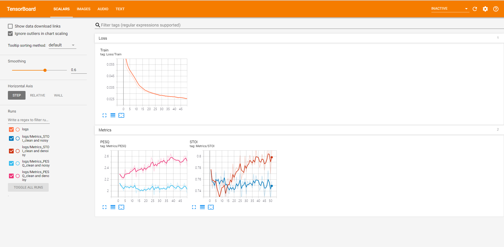
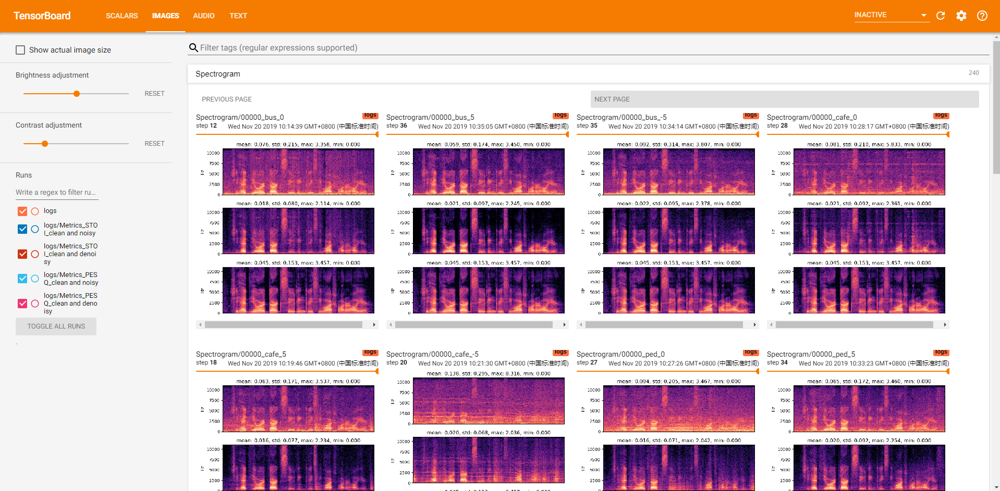

# IRM based Speech Enhancement using LSTM

基于理想浮值掩蔽（Ideal Ratio Mask，IRM）使用 LSTM 进行语音增强。




## 准备

- Python 3.7.x
- CUDA 10.1
- Pytorch 1.3

```shell
conda install tensorboard
pip install matplotlib librosa pystoi json5
pip install https://github.com/vBaiCai/python-pesq/archive/master.zip
```

## 使用方法

```shell script
git clone https://github.com/haoxiangsnr/UNetGAN.git
```

### 训练（train.py)

使用 `train.py` 训练模型，接收如下参数：

- `-h`，显示帮助信息
- `-C`, `--config`, 指定训练相关的配置文件，通常存放于`config/train/`目录下，配置文件拓展名为`json5`
- `-R`, `--resume`, 从最近一次保存的模型断点处继续训练

语法：`python train.py [-h] -C CONFIG [-R]`，例如：

```shell script
python train.py -C config/20121212_noALoss.json5
# 训练模型所用的配置文件为 config/20121212_noALoss.json5
# 默认使用所有的GPU训练

CUDA_VISIBLE_DEVICES=1,2  python train.py -C config/20121212_noALoss.json5
# 训练模型所用的配置文件为 config/20121212_noALoss.json5
# 使用索引为1、2的GPU训练

CUDA_VISIBLE_DEVICES=1,2  python train.py -C config/20121212_noALoss.json5 -R
# 训练模型所用的配置文件为 config/20121212_noALoss.json5
# 使用索引为1、2的GPU训练
# 从最近一次保存的模型断点处继续训练
```

补充说明：

- 一般训练所需要的配置文件名都放置在`config/train/`目录下，配置文件拓展名为`json5`
- 配置文件中的参数作用见“参数说明”部分


### 增强（enhancement.py）

TODO

### 测试（test.py）

TODO

### 可视化

训练过程中产生的所有日志信息都会存储在`<config["root_dir"]>/<config filename>/`目录下。这里的`<config["root_dir"]>`指配置文件中的 `root_dir`参数的值，`<config filename>`指配置文件名。
假设用于训练的配置文件为`config/train/sample_16384.json5`，`sample_16384.json`中`root_dir`参数的值为`/home/Exp/UNetGAN/`，那么训练过程中产生的日志文件会存储在 `/home/Exp/UNetGAN/sample_16384/` 目录下。该目录包含以下内容：

- `logs/`: 存储`Tensorboard`相关的数据，包含损失曲线，语音波形，语音文件等
- `checkpoints/`: 存储模型训练过程中产生的所有断点，后续可通过这些断点来重启训练或进行语音增强
- `<Date>.json`文件: 训练时使用的配置文件的备份

## 参数说明

训练，测试与增强都需要指定具体的配置文件。

### 训练参数

训练过程中产生的日志信息会存放在`<config["root_dir"]>/<config filename>/`目录下

```json5
{
    "seed": 0,  // 为Numpy，PyTorch设置随机种子，保证实验的可重复性
    "description": "",  // 实验描述
    "root_dir": "/media/imucs/DataDisk/haoxiang/Experiment/IRM",    // 项目根目录
    "cudnn_deterministic": false,   // 开启可保证实验的可重复性，但影响性能
    "trainer": {
        "epochs": 1200, // 实验进行的总轮次
        "save_checkpoint_interval": 10, // 存储模型断点的间隔
        "validation": {
            "interval": 10, // 执行验证的间隔
            "find_max": true,
            "custom": {
                "visualize_audio_limit": 20,    // 验证时 Tensorboard 中可视化音频文件的数量
                "visualize_waveform_limit": 20, // 验证时 Tensorboard 中可视化语音波形的数量
                "visualize_spectrogram_limit": 20,  // 验证时 Tensorboard 中可视化语谱图的数量
            }
        }
    },
    "generator_model": {
        "module": "model.generator_basic_model",    // 存放生成器的文件
        "main": "GeneratorBasicModel",  // 生成器类
        "args": {}  // 传递给生成器类的参数
    },
    "model": {
        "module": "model.discriminator_basic_model",    // 存放判别器的文件
        "main": "DiscriminatorBasicModel",  // 判别器类
        "args": {}  // 传递给判别器类的参数
    },
    "loss_function": {
        "module": "util.loss",  // 存放生成器额外损失的文件
        "main": "mse_loss", // 具体损失函数
        "args": {}  // 传给该函数的参数
    },
    "optimizer": {
        "lr": 0.0002, // 学习率
        "beta1": 0.9,   // Adam动量参数1
        "beta2": 0.999  // Adam动量参数2
    },
    "train_dataset": {
        "module": "dataset.waveform_dataset",
        "main": "WaveformDataset",
        "args": {
         // 详见 dataset/*_dataset.py
        }
    },
    "validation_dataset": {
        "module": "dataset.waveform_dataset",
        "main": "WaveformDataset",
        "args": {
        // 详见 dataset/*_dataset.py
        }
    },
    "train_dataloader": {
        "batch_size": 400,
        "num_workers": 40,
        "shuffle": true,
        "pin_memory": true
    }
}
```

### 验证参数

TODO

### 测试参数

TODO

## 可重复性

我们已经将可以设置随机种子的位置抽离成了可配置的参数，这保证了基本的可重复性。
如果你使用 CuDNN 进行运算加速，还可以进一步设置确定性参数“cudnn_deterministic”为“True”，但这会影响性能。

## 须知

当前项目并非严肃的生产项目，若你发现 bug，请不要犹豫，直接提交 pull request.

## ToDo

- [x] LSTM models
- [x] Training logic
- [x] Validation logic
- [x] Visualization of validation set (waveform, audio, spectrogram, config)
- [x] PESQ and STOI metrics
- [x] Optimize config parameters
- [x] Improve the documentation
- [ ] Test script
- [ ] English version README


## LICENSE

MIT License

Copyright (c) 2019 郝翔
